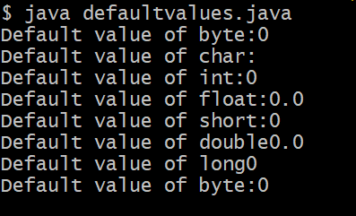
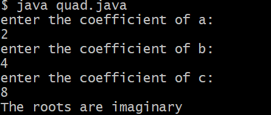

#EXP 1
## exp 1a Title:To display all primitive data types
```java
public class defaultvalues{
      byte b;
      char c;
      int i;
      float f;
      short s;
      double d;
      long  l;
      boolean bool;
     public  static void main(String args[]){
          defaultvalues obj=new defaultvalues();
           System.out.println("Default value of byte:"+obj.b);
           System.out.println("Default value of char:"+obj.c);
           System.out.println("Default value of int:"+obj.i);
           System.out.println("Default value of float:"+obj.f);
           System.out.println("Default value of short:"+obj.s);
           System.out.println("Default value of double"+obj.d);
           System.out.println("Default value of long"+obj.l);
           System.out.println("Default value of byte:"+obj.b);
}
}

```
#OUTPUT:


##exp 1b Title:To display roots of quadratic equation
```java
import java.util.Scanner;
public class quad{
      public static void main(String  args[]){
           Scanner S=new Scanner(System.in);
           System.out.println("enter the coefficient of a:");
           double a=S.nextDouble();
           System.out.println("enter the coefficient of b:");
           double b=S.nextDouble();
           System.out.println("enter the coefficient of c:");
           double c=S.nextDouble();
           S.close();
           double discriminant=b*b-4*a*c;
           if(discriminant>0){
             double root1=(-b+Math.sqrt(discriminant))/2*a;
             double root2=(-b-Math.sqrt(discriminant))/2*a;
             System.out.println("The roots are real  and distinct");
             System.out.println("Root1:"+root1);
             System.out.println("Root2:"+root2);
             }
          else if(discriminant==0){
               double root=-b/2*a;
               System.out.println("The roots are real  and equal");
               System.out.println("Root:"+root);
               }
          else{
              System.out.println("The roots are imaginary");
              }
}
}
```
#OUTPUT:

